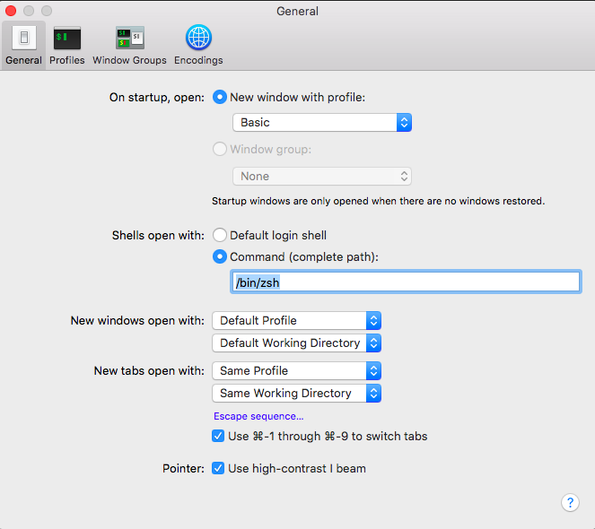

#   WEB DEVELOPMENT IMMERSIVE

# _Install Oh My ZSH_

## Objective

* Learn why Oh My ZSH is a great developer tool

* How to install Oh My ZSH

* How to use Oh My ZSH

## Why use Oh My ZSH?

When you start a terminal application, whether it be on your server or your local computer, it is running a shell called Bash. Bash is by far the most popular shell and comes with pretty much every UNIX-based operating system. There are, however, alternatives to Bash that make using the terminal faster and more comfortable for web developers.

One of the most popular shells with web developers is the Z shell, or ZSH. Along with that, we use a ZSH framework named Oh My ZSH.

Oh My ZSH comes with many tools that can increase your workflow, including but not limited to:
* Terminal Customization
* Color Schemes
* File Tabbing
* etc.

## How to install Oh My Zsh!
First, we will change the default "shell" or terminal environment to use one that is more friendly for developers.

Open the `Terminal` app and type the following two commands (Hit `<Enter>` after each):
```
brew install zsh zsh-completions
```

Verify installation by running `zsh --version`. Expected result: zsh 5.1.1 or more recent.

Make it your default shell: 
* Open `Terminal` preferences <kbd>⌘</kbd> <kbd>,</kbd>
* Click the 'General' Tab
* Click 'Shell opens with Command (complete path)'
* Type `/bin/zsh` inside the text field



Log out and login back again to use your new default shell.
Test that it worked with 
```echo $SHELL```

Expected result: /bin/zsh or similar.

Install oh-my-zsh 
```
sh -c "$(curl -fsSL https://raw.githubusercontent.com/robbyrussell/oh-my-zsh/master/tools/install.sh)"
```

## Terminal Customization

Customizing what your terminal looks like is one of the best things you can do. Not only does it make you look like a hardcore coder, but it can greatly improve readability via different colors. It can also improve productivity by displaying important information related to **file path**, **Git branch** and more!


### Color Schemes

To edit the colors or theme:
* Open `Terminal` preferences <kbd>⌘</kbd> <kbd>,</kbd>
* Click the 'Profiles' Tab
* Change the colors of the `text` and `background` to your preferred colors
* You can also select an existing them from the left column

### File Tabbing

Probably one of the most useful features of ZSH is that it enables us to list and tab through files and folders. If you have ever tried to perfectly spell the name of a file, struggled with the case or fought with an impossibly long list of folders with spaces in it, you know the pain and limitations of Bash.

Folder and file tabbing works with any terminal command: `cd`, `trash`, `cp`, `open`, `code`, etc. But for the purposes of this tutorial, let’s use `cd` for folders and `open` for files.

* Open `Terminal` 
* Go ahead and type `cd` (note the space after `cd`), and hit the <kbd>Tab</kbd> key twice. You can now use your arrow keys to move over, up and down through the files and folders. To select a folder, hit <kbd>Return</kbd> You can now hit <kbd>Tab</kbd> and <kbd>Tab</kbd> again to discover subdirectories or hit <kbd>Return</kbd> to run the command.

## Additional Resources
* [Oh My ZSH Docs](https://ohmyz.sh/)

